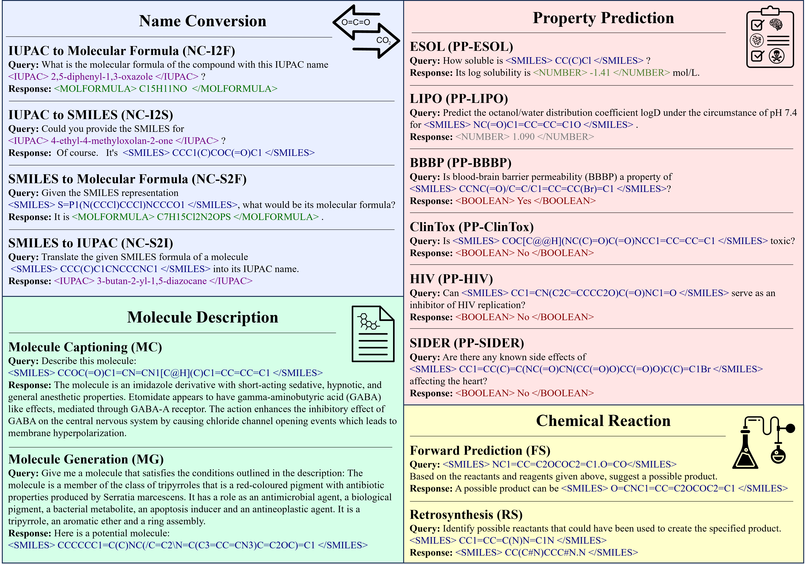

# LlaSMol
This is the official code repository for the paper *LlaSMol: Advancing Large Language Models for Chemistry with a Large-Scale, Comprehensive, High-Quality Instruction Tuning Dataset*.

- Paper: https://arxiv.org/abs/2402.09391
- Page: https://osu-nlp-group.github.io/LLM4Chem
- Code: https://github.com/OSU-NLP-Group/LLM4Chem
- Models: https://huggingface.co/osunlp/LLM4Chem

## Tasks and Examples

Our models are trained on 14 essential tasks, which, along with examples, are illustrated in the following figure.



## Usage

Clone this repo to your machine, and `cd` to the folder.

### Generation

```python
from generation import LlaSMolGeneration

generator = LlaSMolGeneration('osunlp/LlaSMol-Mistral-7B')

generator.generate('Can you tell me the IUPAC name of <SMILES> C1CCOC1 </SMILES> ?')
```

**Note**: 
1. In the input query, please use corresponding tags to wrap up specific content. 
    - SMILES representation: `<SMILES> ... </SMILES>`
    - IUPAC name: `<IUPAC> ... </IUPAC>`
    
    Other tags may appear in models' responses:
    - Molecular formula: `<MOLFORMULA> ... </MOLFORMULA>`
    - Number: `<NUMBER> ... </NUMBER>`
    - Boolean: `<BOOLEAN> ... </BOOLEAN>`

    Please see the examples in the above [figure](#tasks-and-examples).

2. You do not have to canonicalize SMILES, as our code would do it for you.


<!-- **Name Conversion - IUPAC to Molecular Formula**
```
What is the molecular formula of the compound with this IUPAC name <IUPAC> 2,5-diphenyl-1,3-oxazole </IUPAC> ?
```

**Name Conversion - IUPAC to SMILES**
```
Could you provide the SMILES for <IUPAC> 4-ethyl-4-methyloxolan-2-one </IUPAC> ?
```

**Name Conversion - SMILES to Molecular Formula**
```
Given the SMILES representation <SMILES> S=P1(N(CCCl)CCCl)NCCCO1 </SMILES>, what would be its molecular formula?
```

**Name Conversion - SMILES to IUPAC**
```
Translate the given SMILES formula of a molecule <SMILES> CCC(C)C1CNCCCNC1 </SMILES> into its IUPAC name.
```

**Property Prediction - ESOL**
```
How soluble is <SMILES> CC(C)Cl </SMILES> ?
```

**Property Prediction - LIPO**
```
Predict the octanol/water distribution coefficient logD under the circumstance of pH 7.4 for <SMILES> NC(=O)C1=CC=CC=C1O </SMILES> .
```

**Property Prediction - BBBP**
```
Is blood-brain barrier permeability (BBBP) a property of <SMILES> CCNC(=O)/C=C/C1=CC=CC(Br)=C1 </SMILES> ?
```

**Property Prediction - HIV**
```
Can <SMILES> CC1=CN(C2C=CCCC2O)C(=O)NC1=O </SMILES> serve as an inhibitor of HIV replication?
```

**Property Prediction - SIDER**
```
Are there any known side effects of <SMILES> CC1=CC(C)=C(NC(=O)CN(CC(=O)O)CC(=O)O)C(C)=C1Br </SMILES> affecting the heart?
```

**Molecule Captioning**
```
Describe this molecule: <SMILES> CCOC(=O)C1=CN=CN1[C@H](C)C1=CC=CC=C1 </SMILES>
```

**Molecule Generation**

It is not required to use tags to wrap up the input description.

```
Give me a molecule that satisfies the conditions outlined in the description: The molecule is a member of the class of tripyrroles that is a red-coloured pigment with antibiotic properties produced by Serratia marcescens. It has a role as an antimicrobial agent, a biological pigment, a bacterial metabolite, an apoptosis inducer and an antineoplastic agent. It is a tripyrrole, an aromatic ether and a ring assembly.
```

**Forward Synthesis**
```
<SMILES> NC1=CC=C2OCOC2=C1.O=CO</SMILES> Based on the reactants and reagents given above, suggest a possible product.
```

**Retrosynthesis**
```
Identify possible reactants that could have been used to create the specified product. <SMILES> CC1=CC=C(N)N=C1N </SMILES>
``` -->


## To-Do Items
These will be uploaded soon:
- [x] Generation code.
- [ ] Detailed documentation.
- [ ] Evaluation code.
- [ ] More models' weights.

## Citation
If our paper or related resources prove valuable to your research, we kindly ask for citation. Please feel free to contact us with any inquiries.
```
@article{yu2024llasmol,
    title={LlaSMol: Advancing Large Language Models for Chemistry with a Large-Scale, Comprehensive, High-Quality Instruction Tuning Dataset},
    author={Botao Yu and Frazier N. Baker and Ziqi Chen and Xia Ning and Huan Sun},
    journal={arXiv preprint arXiv:2402.09391},
    year={2024}
}
```